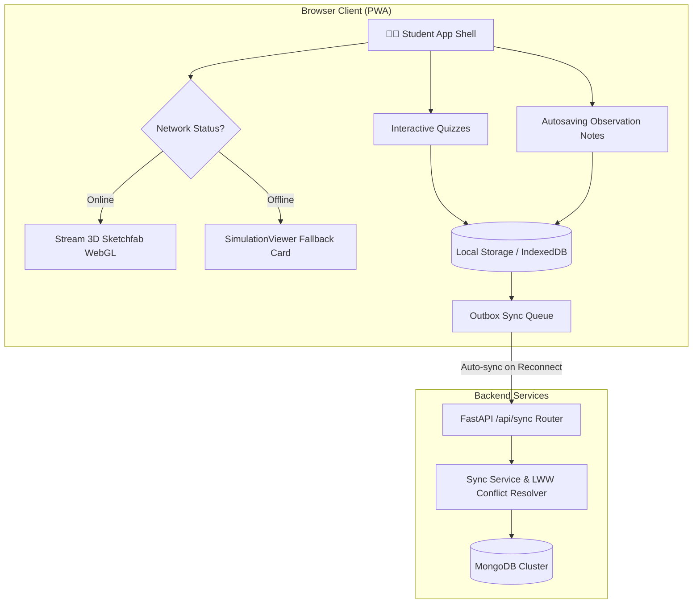

# 🔬 Virtual Science Lab Simulator

<div align="center">

[](https://react.dev/)
[](https://fastapi.tiangolo.com/)
[](#-offline-mode--pwa-capabilities)
[](https://opensource.org/licenses/MIT)

### 🌍 Revolutionizing Science Education Through Interactive & Safe Virtual Experimentation

[Overview](#-overview) • [Key Features](#-key-features) • [PWA & Offline Mode](#-offline-mode--pwa-capabilities) • [Tech Stack](#-tech-stack) • [System Architecture](#-system-architecture) • [Getting Started](#-getting-started) • [Contributing](#-contributing)

</div>

---

## 📖 Overview

**Virtual Science Lab Simulator** is an interactive, high-fidelity web application designed to empower students to conduct scientific experiments in a safe, cost-effective, and fully digital environment. 

By providing highly visual 3D model simulations, the platform enables students to explore:
* 🧬 **Biology**: Interactive anatomy, mitochondria cells, renal structures, and human sensory organs.
* 🧪 **Chemistry**: Practical equipment layouts, chemical titration, condensers, and neutralization reactions.
* ⚡ **Physics**: Electromagnetic fields, Fleming's right-hand rule, and kinematic velocity & acceleration models.

---

## 🚀 Key Features

### 🎮 Interactive 3D Simulations
* **High-Fidelity Models**: Explore detailed 3D scientific structures directly in the browser using Sketchfab WebGL models.
* **Guided Instructions**: Follow structured pedagogical guides featuring precise Aims, Theories, Procedures, and Safety Precautions.

### 📝 Smart Notes & observations
* **Autosave Notes**: Record observations, draft conclusions, and document key takeaways in real-time.
* **Universal Exporters**: Download study logs instantly as formatted Plain Text (`.txt`), Markdown (`.md`), or compile local PDF reports.

### 🏆 Gamification & Post-Lab Quizzes
* **Interactive Evaluations**: Test comprehension with post-experiment quizzes complete with immediate explanations.
* **Milestone Achievements**: Earn Experience Points (XP) and unlock professional subject-themed badges (e.g., *Junior Biologist*, *Physics Pro*) based on test performance.

---

## 🔌 Offline Mode & PWA Capabilities

To ensure accessibility in remote, low-network, or unstable internet environments, the platform functions as an installable **Progressive Web App (PWA)** equipped with complete local data persistence:

1. **Asset Caching**: Leverages a robust Service Worker (`sw.js`) to cache the application shell, layout modules, and static assets, providing instant loads offline.
2. **Local Persistence (IndexedDB)**: Integrates a local database wrapper (`offlineDb`) to capture and save:
   * Experiment completion records and recommendation history.
   * Student observations and autosaved lab notes.
   * Full quiz attempts, completed scores, and badge unlocks.
3. **Simulated Gamification Playback**: Quizzes are fully playable offline. XP gains and badge conditions are calculated entirely on the client, giving students immediate positive feedback.
4. **Outbox Synchronization**: Unsynced updates are queued as actions inside an IndexedDB outbox. The background `<SyncManager />` automatically batch-syncs these actions to the `/api/sync` backend API as soon as connection is restored, resolving conflicts using timestamp-based Last-Write-Wins (LWW) logic.
5. **Visual Fallbacks**: External Sketchfab WebGL iframes gracefully degrade offline to a premium glassmorphic visual card, while keeping static lessons, local notes, and quizzes accessible.

---

## 🛠️ Tech Stack

### Frontend
* **Core Framework**: React 19 (JSX) & React Router v7 (Client-side routing)
* **Styling & UI**: Tailwind CSS (Utility styling) & Framer Motion (Smooth layout transitions)
* **Local Persistence**: Browser IndexedDB (`offlineDb` schema) & LocalStorage (App settings)
* **Offline Caching**: Vanilla Service Worker (`sw.js` fetch interceptor)

### Backend
* **Core Engine**: Python & FastAPI (High-performance API endpoints)
* **Object Mapping**: Pydantic v2 (Input schemas & responses)

### Database & Deployments
* **Primary Storage**: MongoDB (Append-only quiz attempts, notes tables, user gamification progress)
* **Hosting**: Vercel (Frontend client) & Render (Backend API services)

---

## 🧠 System Architecture



---

## 📂 Project Structure

```bash
Virtual_Science_lab/
├── Backend/                  # FastAPI Application Source
│   ├── app/
│   │   ├── api/              # API Route Handlers (sync, gamification, notes, progress)
│   │   ├── core/             # Configuration & Database Connection Singletons
│   │   ├── models/           # Data Schemas (optional migrations)
│   │   └── services/         # Core Business Logic & MongoDB Aggregators
│   └── main.py               # Main Server Entry Point
│
├── frontend/                 # Vite + React Client Source
│   ├── public/               # Static PWA Assets (manifest.json, sw.js, icon.svg)
│   ├── src/
│   │   ├── components/       # Visual Elements (SimulationViewer, SyncManager, Quiz, Notes)
│   │   ├── context/          # State Providers (Gamification, Notes, Progress, OnlineStatus)
│   │   ├── experiments/      # Subject Laboratories (Biology, Chemistry, Physics)
│   │   ├── pages/            # Core App Views (Home, Profile, Subject Directories)
│   │   ├── utils/            # Database Helpers (offlineDb.js)
│   │   └── main.jsx          # App Entry & Service Worker Registration
│   ├── index.html            # PWA Header Links
│   └── vite.config.js        # Vite Configuration
│
└── docs/                     # Technical Guides & Specifications
```

---

## 🚀 Getting Started

### 📥 1. Clone the Repository
```bash
git clone https://github.com/darshan02parmar/Virtual_Science_lab.git
cd Virtual_Science_lab
```

### 🎨 2. Frontend Setup (Client)
```bash
cd frontend
npm install
npm run dev
```
* The React client runs at: `http://localhost:5173`

### ⚙️ 3. Backend Setup (API Server)
Ensure you have a MongoDB instance running locally or via Atlas. 
Create a `.env` file in the `Backend` directory containing:
```env
MONGODB_URI=mongodb+srv://your-uri
```
Install dependencies and boot the FastAPI dev server:
```bash
cd Backend
pip install -r requirements.txt
uvicorn main:app --reload
```
* The FastAPI server runs at: `http://localhost:8000`
* Access interactive API documentation at: `http://localhost:8000/docs`

---

## 🤝 Contributing

We welcome contributions from developers, educators, designers, and science enthusiasts! 💙

To get started:
1. Read our detailed [CONTRIBUTING.md](./CONTRIBUTING.md) and [CODE_OF_CONDUCT.md](./CODE_OF_CONDUCT.md).
2. Fork the repository, create your feature branch, and submit your pull request!

👉 *If you found this project useful, please consider giving it a ⭐ Star!*

---

## 📜 License

This project is licensed under the **MIT License**. See the [LICENSE](LICENSE) file for details.

Developed with ❤️ to make science education accessible, interactive, and safe for everyone.
